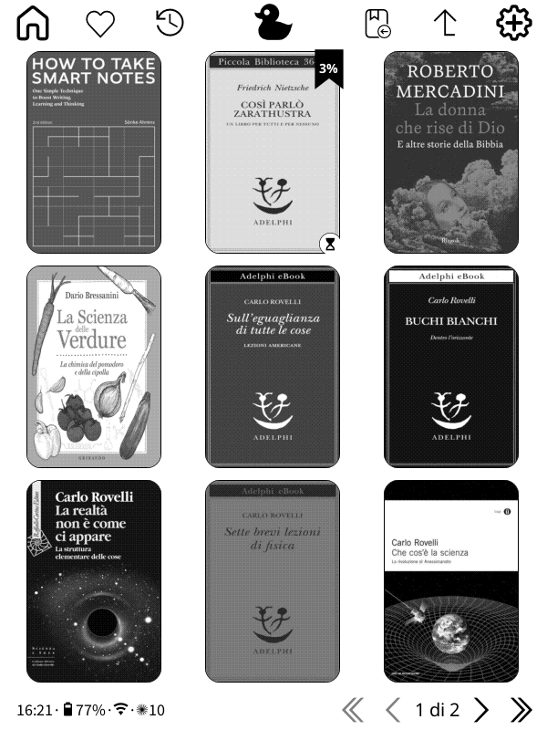
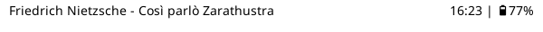
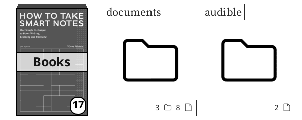
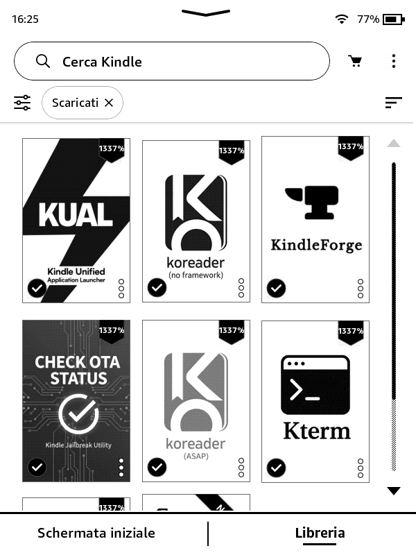

# Kindle Mods

Curated tweaks and assets I use to customize [KOReader](https://github.com/koreader/koreader) and the [Project: Title plugin](https://github.com/joshuacant/ProjectTitle) on Kindle devices.

These patches primarily come from the following repositories:
- [SeriousHornet/KOReader.patches](https://github.com/SeriousHornet/KOReader.patches)
- [joshuacant/KOReader.patches](https://github.com/joshuacant/KOReader.patches)
- [sebdelsol/KOReader.patches](https://github.com/sebdelsol/KOReader.patches)
- [angelsangita/Koreader-Patches](https://github.com/angelsangita/Koreader-Patches)

## koreader_patches
> Hand-picked user patches collected from community sources. Install by copying the chosen `.lua` files to `koreader/patches/`. Toggle a patch off by renaming its file to end with `.disabled`. Grab the matching icons from `icons/` when a patch expects custom artwork.

- `2--disable-all-CB-widgets.lua` – Disables all the progress and status related widgets from COVERBROWSER.
- `2--disable-all-PT-widgets.lua` – Disables all the progress and status related widgets from PROJECT: TITLE.
- `2--rounded-corners.lua` – Adds rounded corners to book covers in mosaic view.
- `2-browser-folder-cover.lua` – This patch adds images to the mosaic folder entries.
- `2-browser-hide-underline.lua.disabled` – Removes the underline beneath the last visited book or folder (disabled).
- `2-faded-finished-books.lua` – Adds a faded look to the finished books.
- `2-menutext-overrides.lua` – Moves articles (a, an, the) to the front of file/folder names, and replaces underscores with spaces.
- `2-new-status-icons.lua` – A set of new custom icons for displaying the status of a book (reading, abandonded, finished).
- `2-pages-badge.lua.disabled` – Shows a small page-count badge on covers (disabled).
- `2-percent-badge.lua` – Displays reading progress as a top-right badge (modified compared to the original patches).
- `2-pt-mm-noborders.lua.disabled` – Changes all the icons to be the same size and fixes spacing to be more equal (disabled).
- `2-reader-footer-widgets.lua` – Lets you curate the footer widgets shown in Project: Title.
- `2-reader-header-cornered.lua` – Adds corner-aligned header widgets to the reading screen.

## projecttitle_mods
> Modified `covermenu.lua`, `mosaicmenu.lua`, and replacement folder icons that restyle Project: Title. The `backup_original` subfolder keeps the stock versions for rollback.
- `mosaicmenu.lua` – Enforces 2:3 cover book aspect ratio, removes borders and divider lines, and adds balanced top/bottom spacing.
- `covermenu.lua` – Removes footer line
- `resources/` – Provides the custom `file.svg`, `folder.svg`, and `file-unsupported.svg` used to restyle Project: Title folders and files.

## documents_backup
> Collection of Home Screen Shortcuts (books) with bespoke covers. Choose the ones you need, copy them to `/mnt/us/documents/`, and they will appear on the Home screen as book-style launchers ready to open your mods.

